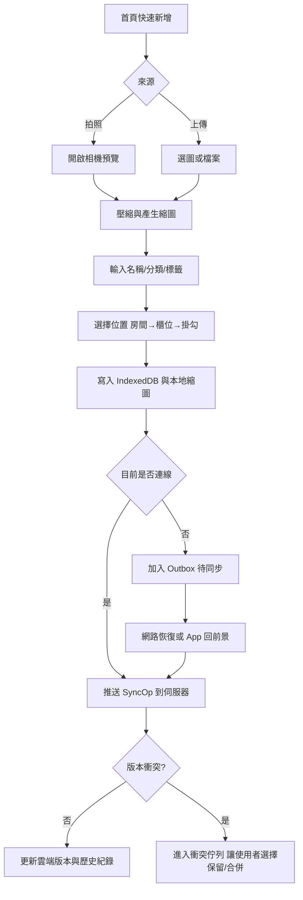
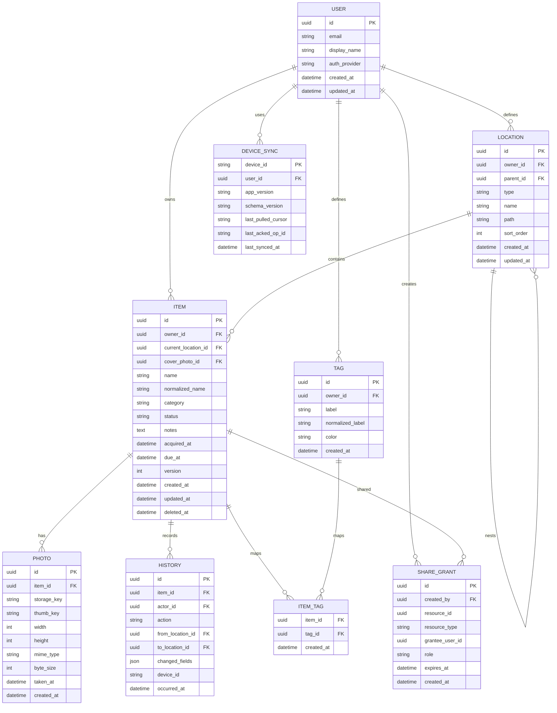

# 以 PWA 實作的照片化物品儲存與收納管理系統分析報告

## 執行摘要

本題最適合採用「**local-first 的 PWA**」架構：前端以單一 Web 程式碼庫提供手機與桌面體驗，利用 **Web App Manifest** 提供可安裝體驗、以 **Service Worker** 與 **Cache Storage** 建立離線 App Shell、以 **IndexedDB** 儲存結構化資料與圖片 Blob，並在網路恢復後再與雲端同步。這種做法特別適合「個人／家庭小規模」的衣物與雜物管理，因為使用者最需要的是：打開就能查、拍完就能存、斷網也能用，而不是先上傳成功才能操作。PWA 的基礎能力與安裝/離線模型，已由 W3C Manifest 規格、MDN 與 web.dev 文件明確支持；local-first 的設計原則也與學術上強調的「離線可用、跨裝置同步、使用者保有資料主權」方向一致。citeturn1search2turn12search10turn10search5turn17search18

若以 MVP 為目標，我建議把系統範圍收斂為：**單一家庭帳號或單使用者**、**物品 CRUD**、**照片拍攝/上傳**、**位置樹狀管理**、**標籤/分類**、**搜尋/過濾**、**移動歷史**、**提醒/到期**、**JSON/CSV 匯入匯出**、**備份/還原**、**離線使用與基本同步**。協作分享、推播提醒、AI 自動分類、OCR/條碼辨識，應列為第二階段，以避免第一版在權限、同步衝突與跨瀏覽器相容性上過度複雜。尤其提醒與分享功能雖然重要，但 Web Notifications、Web Share API、Web Share Target 的支援面與行為仍有平台差異，應以「**有支援時加值，無支援時仍可操作**」為原則。citeturn4search3turn23search2turn2search0turn2search4turn2search3

技術路線上，若優先考慮開發速度與離線能力，**Firebase Firestore + Cloud Storage** 適合 MVP：Web 端可啟用離線持久化，且官方明示離線回線後會同步本機變更，但衝突採 **last write wins**；若考慮 SQL、RLS、資料可攜與自託管彈性，**Supabase** 會更適合中長期，但離線佇列與同步策略需要應用端自己補足。若團隊希望把檔案層和應用層完全拆開，則可用 **S3 + 自建 API**，以預簽名 URL 上傳/下載照片。三種方案都可行，但對本題來說，最重要的不是選哪一家，而是先把「**本地資料模型、同步佇列、版本控制、圖片處理**」設計好。citeturn6search0turn13search0turn6search5turn18search10turn6search3turn6search7turn7search2turn7search6turn19view2

## 目標與使用情境

本報告的主要假設是：系統服務對象為**個人家庭衣物與雜物管理**，規模以小型為主，例如 1–5 位家庭成員、數百到數千件物品、以手機為主要輸入裝置、偶爾在桌面端查詢與整理。PWA 對這類情境的優勢，在於可用同一套 Web 程式碼跨平台提供接近 App 的體驗，並透過 Service Worker、Manifest、IndexedDB 等能力提供安裝、離線與背景能力。citeturn12search18turn1search0turn12search10turn5search17

在此情境下，使用者通常不是要做「精準盤點倉儲」，而是要快速回答幾個生活問題：  
「這件外套放在哪個房間的哪個掛勾？」  
「孩子的冬衣有哪些今年可能穿不下了？」  
「家裡剩下幾條未拆的延長線？」  
「我上次把相機電池移到哪個抽屜了？」  
因此，系統應優先支援**照片導向、位置導向、搜尋導向**三種入口，並把位置建模成家庭式樹狀結構，例如「房間 → 櫃位 → 抽屜/掛勾/箱子 → 自訂位置」。這種樹狀位置模型與本地可搜尋資料結構，很適合由 IndexedDB 儲存與索引。citeturn10search5turn5search17

除主要情境外，可選情境包含：**季節衣物輪替管理**、**租屋搬家前整理**、**收藏品/工具箱管理**、**長輩藥品或保健用品到期提醒**、**家庭共用儲物空間管理**。其中「多使用者協作」與「離線多裝置同步」題目未指定，建議列為可選方案：  
若是單人或單家庭主帳號，採簡化同步與較寬鬆衝突策略即可；若要多成員同時維護，就必須加入角色權限、資料版本控制、衝突偵測與審核機制。這也是 local-first 與協作系統在研究與實務上最常分岔的地方。citeturn17search18turn17search0turn14search0turn14search1

## 核心功能與使用者流程

下表以 **P0 / P1 / P2** 表示優先級，並將題目要求的功能一併落到資料欄位、API 與權限需求。表中的 API 以 REST 風格示意，實作時可對應 REST、RPC 或由 Supabase/Firebase SDK 封裝；重點是維持資源邊界清楚、操作可重試、同步可追蹤。

| 功能 | 優先級 | 主要欄位資料模型 | 必要 API 端點示例 | 裝置/系統權限需求 |
|---|---|---|---|---|
| 新增物品拍照/上傳 | P0 | `Item{id,name,category,status,notes,currentLocationId,coverPhotoId}`、`Photo{id,itemId,blobKey,width,height,takenAt}` | `POST /items`、`POST /items/{id}/photos` | 相機或檔案選取；`getUserMedia()` 僅能在安全內容中使用；檔案上傳可退回 `<input type="file">` citeturn12search2turn25search6 |
| 快速掃描上傳 | P0 | `QuickCaptureSession{id,deviceId,batchId}`、多筆 `Photo` 暫存 | `POST /capture/batch`、`POST /capture/batch/{id}/commit` | 相機/檔案選取；可用 `capture` 屬性提示直接拍攝，但其支援並非完全一致 citeturn25search0turn25search6 |
| 位置標示 | P0 | `Location{id,parentId,type,name,path,sortOrder}` | `GET /locations/tree`、`POST /locations`、`PATCH /items/{id}` | 無額外裝置權限；需使用者編輯權限 |
| 標籤/分類 | P0 | `Tag{id,label,color}`、`ItemTag{itemId,tagId}` | `POST /tags`、`PUT /items/{id}/tags` | 無額外裝置權限；需使用者編輯權限 |
| 搜尋/過濾 | P0 | `Item.searchTextNormalized`、`dueAt`、`status`、`currentLocationId`、`category` | `GET /items?query=&tag=&location=&dueBefore=` | 無裝置權限；本地索引即可離線查詢 |
| 物品歷史/移動紀錄 | P0 | `History{id,itemId,action,fromLocationId,toLocationId,changedFields,actorId,occurredAt}` | `GET /items/{id}/history`、`POST /items/{id}/moves` | 無額外裝置權限；需編輯權限 |
| 提醒/到期 | P1 | `Item{dueAt,reminderAt,reminderState}` | `PATCH /items/{id}`、`GET /reminders` | 通知為可選；行動瀏覽器上建議使用 Service Worker `showNotification()` 而非 `new Notification()` citeturn23search0turn23search2 |
| 批次匯入匯出 | P1 | `ImportJob{id,format,mapping}`、匯出檔 metadata | `POST /imports`、`GET /exports/{id}` | 檔案選取；若使用 File System Access API，可作為桌面增強能力，但不是必要前提 citeturn2search1turn2search9 |
| 備份與還原 | P1 | `BackupSnapshot{id,createdAt,scope,manifest}` | `POST /backups`、`POST /restore` | 檔案下載/上傳；需高權限角色 |
| 分享/授權 | P2 | `ShareGrant{id,resourceType,resourceId,granteeUserId,role,expiresAt}` | `POST /shares`、`PATCH /shares/{id}` | Web Share API 可用於分享連結/檔案，但屬 limited availability；正式授權仍應走系統角色模型 citeturn2search2turn2search4turn2search11 |
| 離線使用與同步 | P0 | `DeviceSync{deviceId,lastPulledCursor,lastPushedAt,lastAckedOpId}`、`SyncOp{id,opType,payload,baseVersion}` | `GET /sync/changes?cursor=`、`POST /sync/push`、`POST /sync/resolve` | 需 Service Worker、IndexedDB、網路狀態偵測；Background Sync 可加值但不應作唯一依賴 citeturn12search10turn10search5turn3search3turn4search2 |

表中的能力設計，主要依據 Manifest、Service Worker、相機/檔案 API、Notifications、Web Share API、Storage API 與雲端服務官方文件整理；其中 camera、service worker、notifications 等能力都要求安全內容，且不同瀏覽器對 `capture`、share target、背景同步與通知的支援度並不完全一致，因此 MVP 要先把「**無該能力時的退場路徑**」設計好。citeturn1search0turn12search2turn15search2turn23search2turn22search1turn2search0turn2search4

以下流程圖建議採「**先本地寫入，再雲端同步**」模式。這可降低拍照時的等待感，也較符合收納情境的高頻、碎片化操作。



介面上建議使用**底部導覽 + 一鍵新增**的手機優先布局，並讓「位置瀏覽」與「搜尋」成為同級入口，而不是把所有功能藏在表單裡。示意如下：

```text
[底部導覽]
首頁 | 位置 | 新增 | 搜尋 | 設定

[首頁]
- 今日提醒
- 最近新增
- 待同步 3
- 快速動作：拍照新增 / 批次掃描 / 匯入

[位置]
客廳
 └ 電視櫃
    ├ 左抽屜（12）
    ├ 右抽屜（8）
    └ 上層掛勾（3）

[搜尋]
[關鍵字________]
篩選：分類 / 標籤 / 房間 / 到期 / 最近移動
結果卡片：縮圖 + 名稱 + 目前位置 + 標籤
```

## 資料模型與 API 設計

若把這個系統當作「家庭收納版的照片化資產管理」，核心不在複雜算法，而在**資料邊界與索引是否正確**。建議至少建立下列實體：`User`、`Item`、`Photo`、`Location`、`Tag`、`ItemTag`、`History`、`DeviceSync`，若要做授權共享，再加 `ShareGrant`。其中 `Location` 必須支援自我關聯，以形成房間/櫃位/掛勾/箱子/自訂位置的樹狀結構；`History` 則是移動、編輯、到期、分享等事件的審計軌跡。這種結構非常適合放在 IndexedDB 與 Postgres/Firestore 之間做同步映射。citeturn10search5turn5search17turn18search12turn13search12



建議的索引如下。這些索引在本地與雲端都很重要，因為它們直接決定搜尋與離線瀏覽的體感速度。

| 實體 | 重要欄位 | 建議索引 | 關聯/目的 |
|---|---|---|---|
| `User` | `email` | `UNIQUE(email)` | 登入識別 |
| `Item` | `owner_id`, `normalized_name`, `current_location_id`, `due_at`, `updated_at`, `deleted_at` | `(owner_id, normalized_name)`、`(owner_id, current_location_id)`、`(owner_id, due_at)`、`(owner_id, updated_at DESC)` | 搜尋、位置篩選、提醒、最近更新 |
| `Photo` | `item_id`, `created_at` | `(item_id, created_at)` | 顯示相簿/封面 |
| `Location` | `owner_id`, `parent_id`, `path`, `sort_order` | `(owner_id, parent_id, sort_order)`、`(owner_id, path)` | 樹狀位置、麵包屑 |
| `Tag` | `owner_id`, `normalized_label` | `UNIQUE(owner_id, normalized_label)` | 避免重複標籤 |
| `ItemTag` | `item_id`, `tag_id` | `UNIQUE(item_id, tag_id)`、`(tag_id, item_id)` | 標籤篩選 |
| `History` | `item_id`, `occurred_at`, `actor_id` | `(item_id, occurred_at DESC)`、`(actor_id, occurred_at DESC)` | 追查移動與編修 |
| `DeviceSync` | `user_id`, `device_id`, `last_pulled_cursor` | `UNIQUE(user_id, device_id)` | 多裝置同步狀態 |
| `ShareGrant` | `resource_id`, `grantee_user_id`, `expires_at` | `(resource_type, resource_id)`、`(grantee_user_id, expires_at)` | 共享授權 |

API 設計上，建議把「同步」當作一級概念，而不是單純 CRUD。也就是說，除了 `POST /items`、`PATCH /items/{id}` 之外，還需要：  
`POST /sync/push`：上傳本機待同步操作；  
`GET /sync/changes?cursor=`：抓取伺服器增量；  
`POST /sync/resolve`：處理衝突。  
若走自建 API，更新端點最好搭配 **ETag / If-Match** 做樂觀鎖定，避免多裝置覆寫；相反地，若走 Firestore，其官方預設衝突行為就是 **last write wins**，因此應把高風險欄位拆細，或在 UI 層做衝突提示。citeturn14search0turn14search1turn13search0

## PWA 技術選型與實作細節

就前端而言，這類系統不需要過重的 SSR；它更像一個已登入、資料密集、離線優先的應用。因此建議首選 **TypeScript + React + Vite**，再加上 **Workbox**、**IndexedDB 封裝層**、**簡單的狀態管理**。原因很實際：Manifest/Service Worker/Runtime Caching/圖片處理/IndexedDB 這些能力，與一般 CSR 應用整合會比 SSR 更直接；Workbox 也正是為 Service Worker 路由、預快取與執行期快取而設計。若團隊偏好 Vue，同等方案可用 Vue 3 + Vite。重點不是框架品牌，而是：**要把 app shell、資料層、同步層、圖片管線分開**。citeturn15search1turn15search3turn15search8turn12search18

相機與圖片處理建議分兩層實作。第一層是**優先使用 `getUserMedia()`** 提供即時預覽與拍照體驗；第二層是**退回檔案上傳**，也就是 `<input type="file" accept="image/*">`，在行動裝置上可搭配 `capture="environment"` 提示後鏡頭，但 `capture` 屬性本身不是完整 Baseline，因此只能視為增強能力，不能當唯一入口。影像處理建議流程為：選檔/拍照後，以 `createImageBitmap()` 解碼，再用 Canvas 縮放，最後用 `toBlob()` 產生主圖與縮圖。由於圖片壓縮沒有放諸四海皆準的品質值，應以實拍測試找出合適的尺寸與壓縮率；若 특정格式不支援，瀏覽器會回退到可用格式，因此實作上要做格式偵測，而不是假設所有裝置都能穩定輸出 WebP。citeturn0search1turn0search9turn25search0turn25search6turn11search5turn11search0turn11search3

離線資料儲存方面，建議明確分工：  
**Cache Storage** 存 App Shell、圖示、字型、靜態資產；  
**IndexedDB** 存 `Item`、`Location`、`Tag`、`History`、`SyncOp` 與圖片 Blob/縮圖；  
**Web Storage** 不要拿來存主要業務資料，因為它是同步 API，且不適合複雜資料，也不能在 service worker 中使用。對需要保存較多圖片的系統，還應在首次大量同步或啟用離線備份時呼叫 `navigator.storage.persist()` 申請持久儲存，並以 `navigator.storage.persisted()` / `estimate()` 檢查狀態與容量，因為瀏覽器在儲存壓力下可能驅逐 best-effort 資料。citeturn15search2turn10search5turn5search17turn22search0turn22search1turn22search2turn22search14turn5search1

同步策略建議按場景拆成三檔：  
**方案 A：單使用者、少量裝置**。採本地 outbox + server cursor，衝突用 last-write-wins 或欄位級 merge，最省工。  
**方案 B：家庭共用**。對 `name`、`notes`、`currentLocationId` 這類欄位加入版本號與 ETag/If-Match；若 412 或版本不符，就把雙方差異送進「衝突匣」。  
**方案 C：高協作密度**。若未來真的需要多人同時改標籤、備註與位置，才考慮 event sourcing 或 CRDT。學術研究已證明離線協作 Web App 可用 CRDT 避免部分衝突，但對家庭收納系統來說通常過度工程化。Background Sync 與 Periodic Background Sync 最適合作為「加值觸發器」，例如在恢復連線後自動送 outbox；但因其支援度與穩定性限制，不能把它當唯一同步來源，仍應在 `online`、App 回前景與手動下拉刷新時補同步。citeturn13search0turn14search0turn14search1turn3search3turn4search2turn17search0turn17search18

儲存空間估算建議用「**公式 + 假設範圍**」而不是寫死數字。以專案假設為例：若主圖壓縮後平均約 300–600 KB、縮圖 20–80 KB，則每件物品 1 張主圖 + 1 張縮圖大約落在 320–680 KB，加上 metadata 可近似視為 0.35–0.7 MB/件；300 件物品約 105–210 MB，1000 件物品約 350–700 MB。這與 web.dev 對 Web 儲存配額/驅逐策略的提醒完全一致：若你要把大量圖片留在離線端，容量管理與持久儲存就不是「優化」，而是正式功能。citeturn11search3turn11search0turn5search1turn22search14

第三方服務方面，建議如下表。成本都以官方價格頁或官方用量文件為準；實際帳單仍會依地區、流量、操作次數與外傳流量而變動。

| 方案 | 適合情境 | 優點 | 風險/缺點 | 成本觀感 |
|---|---|---|---|---|
| Firebase Firestore + Cloud Storage | MVP、快速上線、單人/少量共享 | Web 有官方離線持久化；同步簡單；照片可放 Cloud Storage；免費額度明確 | 衝突預設為 last write wins；資料模型偏文件導向；Web 離線快取對敏感裝置要謹慎 | Firestore 免費額度含 1 GiB 儲存、50K reads/day、20K writes/day；Cloud Storage 免費含 5 GB 儲存，之後依用量計費 citeturn6search0turn13search0turn19view1turn19view3 |
| Supabase | 需要 SQL、RLS、可攜性、長期彈性 | Postgres、Auth、RLS、Storage 一體；角色授權清楚；備份與成本控制文件完整 | 離線佇列與同步需自行處理；若超額且 Spend Cap 開啟，服務可能受限 | Free 含 500 MB DB、1 GB Storage；Pro/Team 含 8 GB disk、100 GB storage、250 GB egress，超額才加價，Pro 計價基礎為官方 Pro 方案與額外 compute/disk/storage 用量 citeturn18search10turn6search3turn6search7turn21search0turn21search4turn21search5turn21search7turn21search10turn21search12 |
| S3 + 自建 API | 需要最強檔案控制、既有後端團隊 | 物件儲存成熟、可用 presigned URL 分離上傳下載、成本可細控 | Auth、同步、權限、metadata、搜尋都要自己做；整體開發成本最高 | S3 Standard 自官方頁面可見為按量計費、無最低用量，並另計 request / transfer；對大量圖片長期保存很有彈性 citeturn19view2turn8search6turn7search2turn7search6 |

綜合建議是：**MVP 首選 Firebase 或 Supabase，圖片量極大且已有後端能力時再考慮 S3 + 自建 API**。若以「家庭收納」這種資料密度和團隊成本來看，最務實的路線通常是：先把 local-first 架構做好，再決定雲端供應商，而不是反過來。citeturn6search0turn18search10turn19view2turn17search18

## 隱私與安全

這類系統表面上像生活工具，但實際上會儲存大量**住家位置資訊、物品所有狀態、購買時間、照片內容**，有些甚至可能拍到個資或敏感文件。因此安全基線應直接以正式 Web App 標準處理，而不是當作普通網站。首先，**HTTPS/TLS 是硬性需求**：`getUserMedia()` 只在安全內容可用，Service Worker 與 Cache Storage 也要求安全內容；沒有 HTTPS，PWA 的安裝、離線與相機功能都會受限或失效。citeturn12search2turn15search2turn12search10

本地加密可分成兩層。第一層是**傳輸與後端儲存安全**，交由 TLS、雲端供應商與存取控制處理；第二層是**端點本地加密**，例如把 `notes`、敏感照片或某些 tag 以 Web Crypto 的 `SubtleCrypto` 進行 AES-GCM 加密後再寫入 IndexedDB。這樣做可以降低共用裝置或瀏覽器快取外洩的風險，但代價是：你必須處理金鑰管理、密碼重設、跨裝置解密與搜尋能力下降。若是一般家庭收納，我建議把「本地加密敏感欄位」列為可選進階功能；若要上線就支援，至少應限制在文字備註與特定分類，而不是一開始就強加全庫加密。citeturn9search0turn9search9turn9search18

認證/授權部分，若只有單人使用，Email Magic Link 或社群登入就足夠；若預期家庭共用與較長期使用，應優先考慮 **Passkeys / WebAuthn**，因為它支援以公開金鑰密碼學做強認證，能避免密碼重用與釣魚風險。若採 Supabase，可直接用其 Auth 與 RLS 來約束每位使用者僅能讀寫自己的資料與照片；若採 Firebase，則應用 Firebase Auth + Security Rules / Storage Rules。會話管理仍應遵循 OWASP 的基本要求，例如唯一且難以預測的 session、登出後失效、避免把敏感識別放入 URL。citeturn9search1turn18search10turn6search3turn6search7turn9search2turn9search5

資料保留政策建議用產品規則明文定義，而不是讓資料默默留存。實務上可採：  
**有效資料**：持續保留；  
**刪除資料**：soft delete 30 天，之後 hard delete；  
**備份**：依方案保留 30–90 天；  
**匯出**：使用者可隨時下載 JSON/CSV + 圖片 ZIP；  
**刪除帳號**：立即撤銷登入狀態、停止分享授權、排程刪除雲端 object 與資料列。  
這樣的政策也能回應 Firestore 官方對 Web 離線持久化的提醒：若應用含敏感資訊，應先確認裝置是否可信，再啟用持久化，因為快取不會在 session 結束後自動清空。citeturn6search0turn18search12turn18search19

## 測試、部署與 MVP 路線圖

部署面上，PWA 至少要完成四件事：  
**正確的 Manifest**、**可註冊的 Service Worker**、**HTTPS**、**可離線啟動的 App Shell**。Manifest 由 W3C 規格與 MDN 定義，是安裝體驗的基礎；web.dev 也明確指出，Manifest 是跨瀏覽器安裝條件的重要組成。Service Worker 則負責攔截請求、快取與離線回應。部署時建議把 manifest 放在站點根目錄，以 `.webmanifest` 與正確 `Content-Type` 提供，並在所有可安裝頁面加入 `<link rel="manifest">`。citeturn1search2turn1search0turn1search1turn1search5turn12search10

測試計畫不應只做功能測試，而要把「PWA 是否像 App 一樣可靠」列成驗收條件。建議最少包含：  
**離線測試**：首次進站後關網，驗證首頁、搜尋、位置樹、最近瀏覽物品是否可用；  
**同步測試**：建立/編輯/移動物品後斷網，再恢復連線，檢查 outbox 是否正確送出；  
**衝突測試**：兩裝置修改同一物品，確認 last-write-wins 或 ETag/If-Match 流程正確；  
**儲存壓力測試**：大量照片下，檢查 `persist()` 申請與容量提示；  
**權限測試**：拒絕相機、拒絕通知後仍能以退場路徑使用；  
**瀏覽器測試**：Chrome/Edge Android、Safari iOS/iPadOS、Safari macOS、Chrome/Edge Desktop。iOS 與 macOS 的安裝體驗和 Chromium 不同：iOS 偏向 Share Menu / Add to Home Screen，macOS Safari 走 Add to Dock。citeturn22search14turn22search1turn14search1turn16search1turn16search2turn16search8

效能驗收建議直接採 **Core Web Vitals** 和 Lighthouse。web.dev 對「良好」體驗的基準是：**LCP ≤ 2.5 秒、INP ≤ 200 毫秒、CLS ≤ 0.1**；Lighthouse 則可作為開發階段自動稽核工具。對本題來說，最重要的不是首頁跑到極致分數，而是**搜尋結果列表與物品詳情頁在中階手機上仍然順暢**，以及首次安裝後離線開頁要夠快。citeturn24search0turn12search0turn12search5turn12search1

MVP 範圍與週次估算，若以 1 名前端 + 1 名全端或同等小團隊為前提，可抓 **8–10 週**。以下是較務實的安排：

| 週次 | 主要交付 |
|---|---|
| 第 1 週 | 需求收斂、資訊架構、資料模型定稿、低保真原型 |
| 第 2 週 | 基礎前端骨架、路由、UI 元件、Manifest、部署骨架 |
| 第 3 週 | `Item` / `Location` / `Tag` 本地 CRUD、IndexedDB schema、搜尋索引 |
| 第 4 週 | 拍照/上傳流程、圖片壓縮與縮圖、快速新增頁 |
| 第 5 週 | 歷史紀錄、位置地圖瀏覽、篩選與搜尋結果優化 |
| 第 6 週 | Service Worker、Cache 策略、離線啟動、Outbox/Inbox 同步雛形 |
| 第 7 週 | 提醒/到期、JSON/CSV 匯入匯出、備份與還原 |
| 第 8 週 | 認證、基本分享/授權、衝突處理、整體整合測試 |
| 第 9–10 週 | 跨瀏覽器修正、性能調校、Lighthouse/離線/權限完整驗收、正式上線 |

MVP 建議**不做**的內容有：多人即時協作、Push 推播全覆蓋、AI 自動辨識、OCR 文本抽取、條碼/QR 掃描、複雜家庭平面圖。這些都很有價值，但不是第一版最能證明產品價值的部分。第一版最重要的是：使用者真的能在家裡快速拍一件物品，放到某個位置，之後用照片、關鍵字或位置把它找回來。第二階段再擴充：OCR 搜尋、AI 自動分類、共享櫃位、批次修圖、系統分享目標、桌面 File System Access 匯出到指定資料夾等。citeturn2search0turn2search1turn2search4turn17search18

## 優先參考來源

本題最值得優先跟讀的來源，應以**官方規格與官方文件**為主，因為需求涉及安裝、相機、離線、同步、通知、儲存與雲端費用，這些都高度依賴實際平台行為與當前官方政策。

| 類別 | 優先來源 | 用途 |
|---|---|---|
| PWA 基礎 | W3C Web Application Manifest、MDN PWA/Manifest、web.dev Learn PWA | 安裝、manifest 欄位、offline shell、平台行為 citeturn1search2turn1search0turn1search1turn12search18 |
| 相機與檔案 | MDN `getUserMedia()`、MDN `capture`、MDN `<input type="file">` | 手機拍照、檔案上傳、權限與退場路徑 citeturn12search2turn25search0turn25search6 |
| 離線儲存 | MDN IndexedDB、web.dev Offline data、MDN Storage API / `persist()` | 離線資料、Blob、配額與持久儲存 citeturn10search5turn5search17turn22search0turn22search1turn22search14 |
| Service Worker 與快取 | MDN Service Worker、Workbox、CacheStorage | App Shell、runtime caching、離線策略 citeturn12search10turn15search1turn15search2turn15search8 |
| 通知與分享 | MDN Notifications / `showNotification()`、MDN Web Share API / `share_target` | 提醒、系統分享、安裝後收圖入口 citeturn23search0turn23search2turn2search0turn2search4 |
| Firebase | 官方 Firestore offline、Firebase Pricing、Cloud Storage docs | MVP 離線與成本評估 citeturn6search0turn19view1turn19view3turn6search5 |
| Supabase | 官方 Auth、RLS、Storage、Billing/Usage docs | SQL/RLS 架構、成本與授權模型 citeturn18search10turn6search7turn6search3turn6search6turn21search0turn21search5 |
| 檔案物件儲存 | AWS S3 Pricing、Presigned URL docs | 圖片儲存拆層、自建 API 模式 citeturn19view2turn7search2turn7search6 |
| 安全 | MDN Web Crypto、MDN WebAuthn、OWASP Authentication / Session Management | 本地加密、Passkeys、會話管理 citeturn9search0turn9search1turn9search2turn9search5 |
| 研究與設計原則 | Local-first Software、CRDT offline collaborative web applications | 為何 local-first 與協作衝突處理值得預先設計 citeturn17search18turn17search0 |

整體結論是：這個題目**非常適合用 PWA 做**，但前提不是「把網站包成像 App」，而是把它真正設計成一個 **local-first、照片導向、位置導向、可容錯同步** 的 Web 應用。若照此報告的方式收斂 MVP，八到十週即可做出可用且有延展性的第一版；若一開始就把協作、AI、自動辨識、全平台推播全部塞進 MVP，反而最容易失去 PWA 最有價值的優勢：**快速落地、跨平台、可離線、低維護成本**。citeturn12search18turn17search18turn12search1